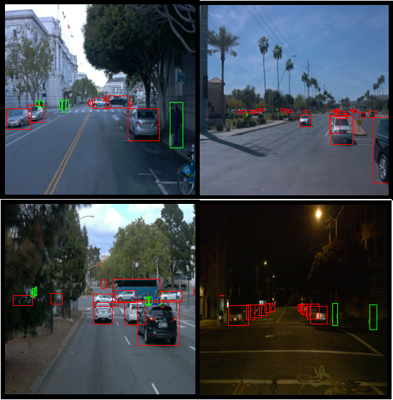
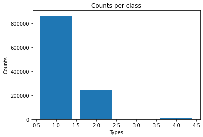
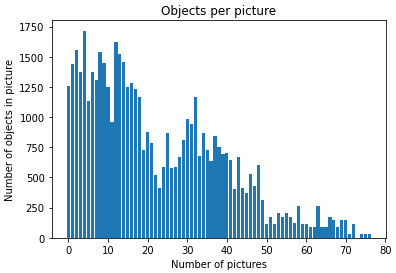
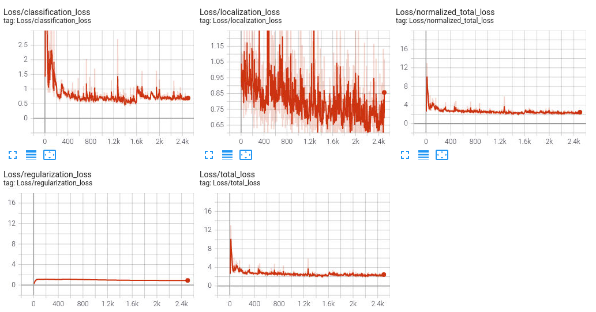
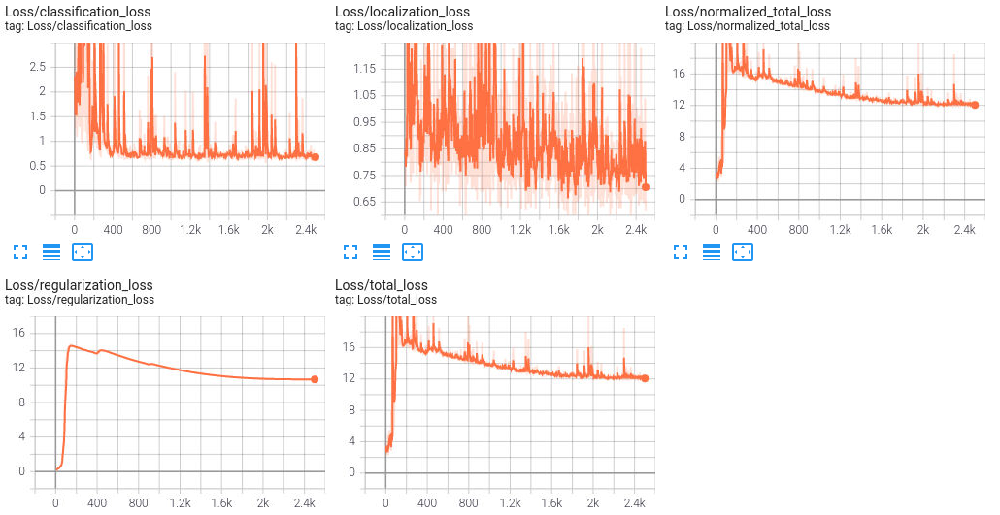
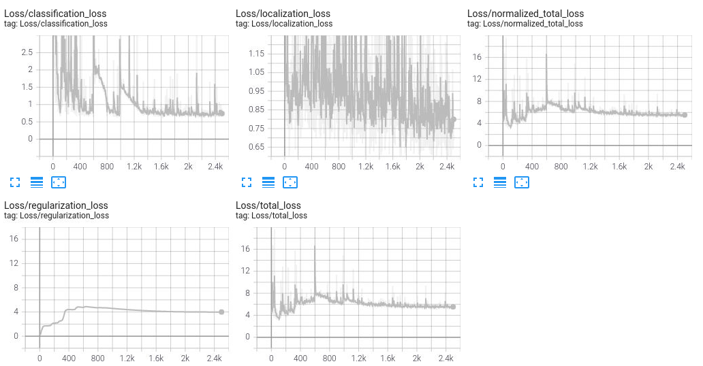
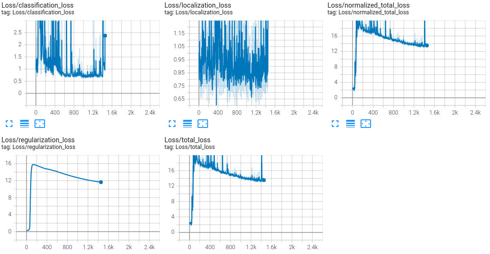
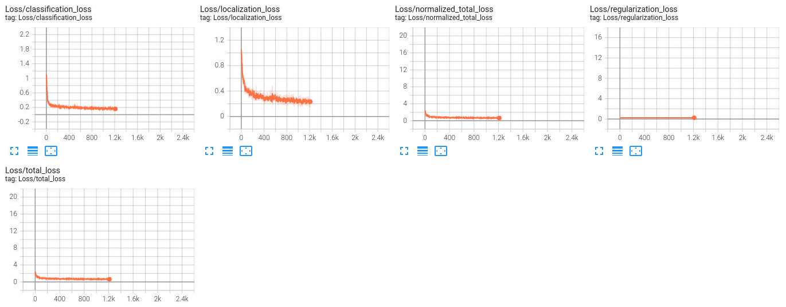
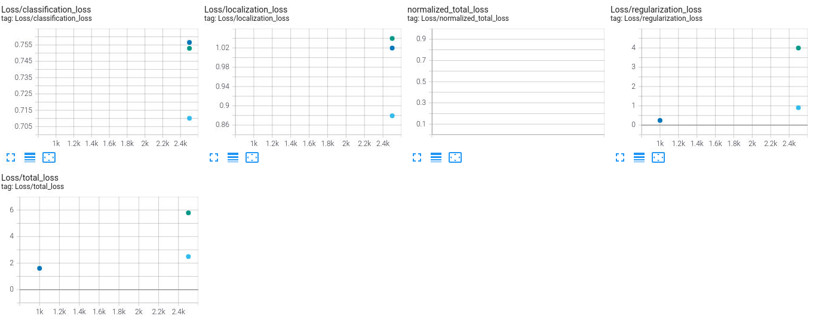

# Object Detection in an Urban Environment

## Project overview

Self-driving cars are one of the most interesting potential developments regarding transport and logistics.
Not only would they enable fleets of autonomous trucks to ship products, they might also lead to greater comfort and safety in personal transportation. Finally, having the possibilty to call cars on a whim, could change the culture of car ownership, reduce the number of cars dramatically and therefore also make cities less car and more human centric.

Object detection is probably the most important technology for self-driving cars. Knowing where to drive and especially, when to stop is crucial to not get anyone killed. This project is therefore exploring ways to augment pictures to improve the detection of cars, pedestrians and bikes in an urban environment.

## Set up

### Requirements
To run this code first install the libraries in the requirements.txt by executing

```
pip install -r requirements.txt
```

### Train model

Start with a pretrained model, which has to be downloaded at

```
http://download.tensorflow.org/models/object_detection/tf2/20200711/ssd_resnet50_v1_fpn_640x640_coco17_tpu-8.tar.gz
```

and moved to

```
/home/workspace/experiments/pretrained_model/
```

Execute the following code to extract it

```
cd /home/workspace/experiments/pretrained_model/

wget http://download.tensorflow.org/models/object_detection/tf2/20200711/ssd_resnet50_v1_fpn_640x640_coco17_tpu-8.tar.gz

tar -xvzf ssd_resnet50_v1_fpn_640x640_coco17_tpu-8.tar.gz

rm -rf ssd_resnet50_v1_fpn_640x640_coco17_tpu-8.tar.gz
```

To change the augmentation for the model training edit the pipeline_new.config file located in

```
experiments\reference\
```

by adding augmentation options. Possible options can be found in

```
https://github.com/tensorflow/models/blob/master/research/object_detection/protos/preprocessor.proto
```

To launch the training process execute

```
python experiments/model_main_tf2.py --model_dir=experiments/reference/ --pipeline_config_path=experiments/reference/pipeline_new.config
```

and to launch the evaluation execute

```
python experiments/model_main_tf2.py --model_dir=experiments/reference/ --pipeline_config_path=experiments/reference/pipeline_new.config --checkpoint_dir=experiments/reference/
```

### Monitoring

To monitor both the training and the evaluation, launch a tensorboard instance by running

```
python -m tensorboard.main --logdir experiments/reference/
```

### Notebooks

To experiment on the augmentation options, use

```
Explore augmentations.ipynb
```

```
Exploratory Data Analysis.ipynb
```
On the other hand, lets you get a glimpse on the data itself.

### Data
The data consists of a set of pictures located in the data folder and split into three sets:

```
-test (3 files)
-train (86 files)
-val (10 files)
```

## Dataset
### Dataset analysis

Looking at a random subset of the files, the dataset seems to consists of pictures of road traffic. There are also three classes of objects in those pictures which are of interest. The training set has them already identified and enclosed by boxes of different colors, structured as followed:

1. Cars (Type 1, red box)
2. Pedestrians (Type 2, green box)
3. Bikes (Type 4, unknown)



As can be seen, some images have been made in the nighttime, being dark and having little color.
Others are also blurry, having little contrast.

A subset of 50.000 files reveales a very uneven distribution regarding the number of encounters of specific types, heavily prefering cars and marginalising bikes.



Also many pictures seem to feature quite a big number of objects, some featuring up to 80.



## Training
### Reference experiment
The first run consisted of the preset conditions, that is:

```
-random crop (cuts part of the pictures, adds some (realistic) randomness)
```



### Improve on the reference

In the second run some augmentations were added, mainly to compensate for dark pictures, resulting in the following list:

```
-random crop
-random horizontal flip (mirrors the pictures at the horizontal axis, adds some (realistic) randomness)
-random adjust brightness (helps with nighttime images)
-random adjust contrast (helps with blurry images)
```



As can be seen the outcome worsened.

Leaving no augmentations on the other hand, worsened the outcome as well.



After various trys with different augmentations, culminating in the following options:

```
-random horizontal flip
-random crop image
-random adjust brightness
-random adjust contrast
-random adjust hue (helps with foggy, or nighttime images)
-random adjust saturation (helps with foggy images)
-random distor color (adds randomness to the color palette)
```



While the process crashed due to low memory the parameters did not show any signes of improvement.

In the last run the augmentations have been reset to:

```
-random crop
```

Alternatively some of the parameters have been changed:

```
batch size 2 -> 6
optimizer learning rate_base 0.04 -> 0.001
warmup_learning_rate: 0.01333 -> 0.001
```

While the training crashed at about 1000 iterations, the outcome seems to be far better:



Comparing the evaluations (the fourth is missing due to low memory) shows a similar picture in the total loss


```
green -> number 3
blue -> final
light blue -> first
```

While the classification loss is the highest in the final iteration, this might be due to the low number of iterations.

### Conclusion

It seems like the main factor for improvement was the change of the batch size and/or the learning rate.
The experiments with the augmentations only worsened the outcome. However, judging by some of the metrics, this might be due to poor selection, as there was i.e. little worsening between the second and the forth run, although the number of augmentations has been greatly enlarged. This *might* indicate that some of the augmentations did in fact better the outcome, counteracting some of the other augmentations. It might also mean that the setting could not be broken any further.

Regardless, more and smaller runs would be needed to measure the effect of specific augmentations in isolation, but that would go beyond the scope of this task (and especially beyond it's resources).


